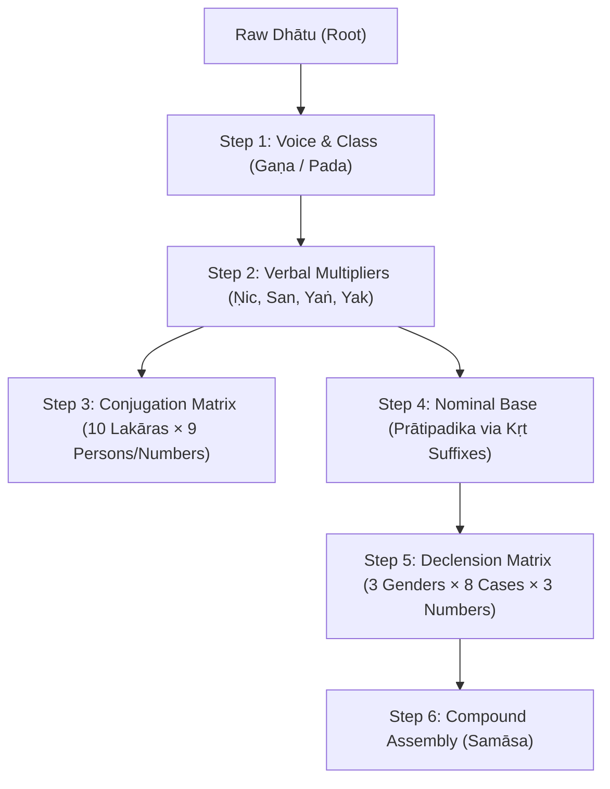

# Sanskrit Grammar for Programmers: A Quick Primer

If you are a programmer, software engineer, or computer scientist exploring Sanskrit for the first time, this document is a quick, approachable introduction to how the language works without the heavy academic jargon.

Unlike many natural languages whose grammars evolved as organic tangles of historical exceptions, **Sanskrit grammar (*Vyākaraṇa*) functions almost exactly like a deterministic programming language and generative compiler.**

The revered sage and visionary grammarian **Pāṇini** codified the language in the *Aṣṭādhyāyī*—a formal rule-based system of roughly 4,000 highly structured algorithmic rules (*sūtras*). When you learn how Sanskrit words are constructed, you aren't memorizing arbitrary vocabulary; you are tracing how structured rules generate complex surface forms from simple base roots.

---

## 1. The Programmer's Mental Model

In modern software engineering, we construct systems out of **base data structures**, **pure functions**, **instantiated structs**, **constants**, and **compilers**. Sanskrit maps cleanly to these computational idioms:

| Software Engineering | Sanskrit Grammar (*Vyākaraṇa*) | How It Works |
| :--- | :--- | :--- |
| **Abstract Base Class / Bytecode** | **Dhātu** ($\sqrt{\text{Root}}$) | Raw, uninflected abstract semantic root (e.g., $\sqrt{\text{gam}}$ = *to go*). |
| **Executable Function / Method** | **Tiṅanta** (Finite Verb) | Root compiled with verbal conjugation suffixes (*tiṅ*). |
| **Instantiated Object / Struct** | **Subanta** (Noun / Adjective) | Root derived into a nominal base (*Prātipadika*) + case endings (*sup*). |
| **Keywords / Constants** | **Avyaya** (Indeclinable) | Immutable tokens (adverbs, conjunctions) that never mutate. |
| **Function Decorators / Wrappers** | **Upasarga** (Prefix) | 22 standard prefixes attached to roots/verbs to mutate semantics. |
| **String Compilation & Macros** | **Sandhi** & **Pratyāhāra** | Deterministic phonetic merging and character-class lookup tables. |

---

## 2. Core Building Blocks

### Dhātu (Semantic Roots)
Every action, object, or descriptive concept in Sanskrit can ultimately be traced back to a **Dhātu**—a raw, uninflected abstract semantic seed.
* *Examples:* $\sqrt{\text{bhū}}$ (*to be / exist*), $\sqrt{\text{gam}}$ (*to go*), $\sqrt{\text{kṛ}}$ (*to do*).

### Tiṅanta (Verbal System)
When a Dhātu combines with verbal suffixes (*tiṅ*), it forms an **Ākhyāta** (finite verb). It explicitly encodes action, tense/mood, person, number, and active/middle voice.
* *Example:* $\sqrt{\text{gam}}$ + active present suffix $\rightarrow$ **gacchati** (*"He / she / it goes"*).

### Subanta (Nominal System)
When a Dhātu combines with primary nominal suffixes (**Kṛt**) or secondary suffixes (**Taddhita**), it derives a nominal base (**Prātipadika**). To be evaluated in a valid sentence, this base must be instantiated with nominal case endings (*sup*).
* *Example:* $\sqrt{\text{gam}}$ + abstract noun suffix $\rightarrow$ **gatiḥ** (*"movement / gait"*).

---

## 3. Modifiers, Constants, and Decorators

### Visarga (`ः` / `ḥ`)
A phonetic modifier representing a soft, unvoiced breath after a vowel (written in Devanāgarī as two vertical dots `ः` and transliterated as `ḥ`). During sentence compilation (*Sandhi*), underlying terminal `-s` or `-r` sounds frequently resolve into a Visarga.
* *Example:* Underlying word `rāmas` becomes surface text **rāmaḥ** (रामः).

### Avyaya (Indeclinable Constants)
Words that are literally *"un-spendable"* (*a-vyaya*). They do not undergo declension across gender, case, or number. They remain identical across every sentence context.
* *Examples:* **ca** (*and*), **atra** (*here*), **evam** (*thus*).

### Upasarga (Semantic Decorators)
Sanskrit defines exactly **22 official prefixes** that attach to the front of roots and verbs. Like wrapper functions or decorators, they drastically alter, enhance, or reverse baseline semantics.

Take the root $\sqrt{\text{hṛ}}$ (*to take / steal*):
* `pra` + $\sqrt{\text{hṛ}}$ $\rightarrow$ **prahāra** (*to strike / hit*)
* `ā` + $\sqrt{\text{hṛ}}$ $\rightarrow$ **āhāra** (*to bring / eat food*)
* `vi` + $\sqrt{\text{hṛ}}$ $\rightarrow$ **vihāra** (*to wander / relax*)
* `sam` + $\sqrt{\text{hṛ}}$ $\rightarrow$ **saṃhāra** (*to destroy*)

---

## 4. State Space: Person, Number, and Tense

Sanskrit verbs are mapped out on a strict $3 \times 3$ grid for every tense.

### Number (*Vacana*)
Unlike English (singular vs. plural), Sanskrit enforces **three** explicit numerical states:
1. **Eka-vacana:** Singular (one item / person).
2. **Dvi-vacana:** Dual (exactly **two** items / people—highly distinct in Sanskrit).
3. **Bahu-vacana:** Plural (three or more items / people).

### Person (*Puruṣa*)
Notice that traditional Sanskrit grammar orders grammatical persons **in reverse** compared to Western textbooks:
1. **Prathama-puruṣa (Third Person):** *"He, she, it, they"* (The one being spoken *about*).
2. **Madhyama-puruṣa (Second Person):** *"You, you two, you all"* (The one being spoken *to*).
3. **Uttama-puruṣa (First Person):** *"I, we two, we all"* (The one speaking—literally the *"highest / excellent person"*).

### Tenses and Moods (*Lakāras*)
Sanskrit uses **10 Lakāras** (named after the letter `L`) to express time and mood:
* **Laṭ-lakāra:** Present Tense (*gacchati* — he goes)
* **Laṅ-lakāra:** Past Tense (*agacchat* — he went)
* **Lṛṭ-lakāra:** Future Tense (*gamiṣyati* — he will go)
* **Loṭ-lakāra:** Imperative Mood / Command (*gacchatu* — let him go!)
* **Vidhi-liṅ-lakāra:** Potential Mood / Should (*gacchet* — he should go)

---

## 5. Combinatorics: What One Root Can Generate

Because Sanskrit is fully derivational, a single root word like $\sqrt{\text{gam}}$ (*to go*) can spawn **thousands** of unique, grammatically precise words. Here is the combinatorial map of what a single root goes through:



### Step 1: Voice and Class (*Gaṇa* & *Pada*)
* **The 10 Gaṇas:** The root is assigned to one of 10 structural classes which determines how it morphs in the present tense.
* **Pada (Voice):**
  * *Parasmaipada:* Active voice (action for someone else).
  * *Ātmanepada:* Middle voice (action affects oneself).
  * *Ubhayapada:* Can do both.

### Step 2: The Verbal Multipliers
From just *one* root, you can create four derived verbal stems before you even apply tenses:
1. **Causative (*Ṇic*):** Making someone else do it ($\sqrt{\text{gam}} \rightarrow \text{gamayati}$ — *"He causes to go"*).
2. **Desiderative (*San*):** Wanting to do it ($\sqrt{\text{gam}} \rightarrow \text{jigamiṣati}$ — *"He wants to go"*).
3. **Intensive (*Yaṅ*):** Doing it repeatedly / intensely ($\sqrt{\text{gam}} \rightarrow \text{jaṅgamyate}$ — *"He walks repeatedly"*).
4. **Passive (*Yak*):** ($\sqrt{\text{gam}} \rightarrow \text{gamyate}$ — *"It is being gone to"*).

### Step 3: The Conjugation Matrix (Verbs)
For *each* of those variations above, you apply the **10 Lakāras (Tenses)**. For each Lakāra, you have a grid of **3 Persons $\times$ 3 Numbers = 9 forms**.
* Just *one* standard verb paradigm yields $10 \times 9 = 90$ basic combinations. Factor in active, passive, and causative stems, and you easily get hundreds of verbal forms from one root.

---

## 6. Anatomy of a Noun (*Subanta*)

If verbs are the engine of Sanskrit, nouns are the vehicles. The nominal system is just as algorithmic as the verbal system, built entirely on structural templates.

```
[Dhātu (Root)] + [Kṛt Suffix] ──> [Prātipadika (Base)] + [Vibhakti (Case)] ──> Fully Formed Noun
```

### Base Classification (*Prātipadika*)
This is the raw base form of a noun before it gets gender markers or case endings. Bases are categorized strictly by their final letter, acting as the "key" to which declension table (template) the word will follow:
* **Ajanta (Vowel-ending):** Words ending in vowels like `-a` (*Rāma*), `-ā` (*Sītā*), `-i` (*Kavi*), `-ī` (*Nadī*).
* **Halanta (Consonant-ending):** Words ending in consonants like `-t` (*Marut* — wind) or `-n` (*Rājan* — king).

### The 8 Cases (*Vibhakti*)
Instead of relying heavily on prepositions like English (*"to the king"*, *"by the sword"*, *"from the forest"*), Sanskrit attaches suffixes directly to the end of the noun base to indicate its role in the sentence.

| Case | Sanskrit Name | English Equivalent / Role | Example (*Rāma*) |
| :---: | :--- | :--- | :--- |
| **1st** | **Prathamā** | **Subject** (The one doing the action) | **rāmaḥ** (*Rāma does*...) |
| **2nd** | **Dvitīyā** | **Direct Object** (The action happens *to* it) | **rāmam** (*...sees Rāma*) |
| **3rd** | **Tṛtīyā** | **Instrumental** (By means of / with) | **rāmeṇa** (*By / with Rāma*) |
| **4th** | **Caturthī** | **Dative** (For / to the benefit of) | **rāmāya** (*For Rāma*) |
| **5th** | **Pañcamī** | **Ablative** (From / away from / because of) | **rāmāt** (*From Rāma*) |
| **6th** | **Ṣaṣṭhī** | **Genitive** (Possession / *"Of"*) | **rāmasya** (*Rāma's / Of Rāma*) |
| **7th** | **Saptamī** | **Locative** (In / On / At / Location) | **rāme** (*In / On Rāma*) |
| **8th** | **Sambodhana** | **Vocative** (Calling out / Addressing) | **he rāma!** (*Oh Rāma!*) |

Every nominal base generates a grid of **8 Cases $\times$ 3 Numbers = 24 distinct forms** per grammatical gender (Masculine, Feminine, Neuter).

> [!TIP]
> **Adjectives as Mirror Shapeshifters**
> Sanskrit adjectives (*Viśeṣaṇa*) behave exactly like nouns, but they are shapeshifters with no fixed gender. They dynamically **mirror** the exact Gender, Number, and Case of the noun they describe. If you are describing a feminine plural noun in the 3rd case, your adjective must be modulated to its feminine plural 3rd-case form.

---

## 7. The Compound Multiplier (*Samāsa*)

Instead of using 5 separate words with 5 separate case endings, Sanskrit allows you to strip the case endings off a string of nouns, weld their bases together into one massive compound word (**Samāsa**), and put a single case ending at the very end.

1. **Avyayībhāva:** The first word dominates and turns the whole compound into an indeclinable adverb (*Yathā-śakti* = According to one's power).
2. **Tatpuruṣa:** The second word dominates; the first word modifies it (*Rāja-puruṣa* = King's man).
3. **Dvandva:** All words share equal weight ("and" compounds, e.g., *Rāma-Lakṣmaṇau* = Rāma and Lakṣmaṇa).
4. **Bahuvrīhi:** The compound points to an outside entity not mentioned in the compound itself (*Pītāmbara* = Yellow-cloth $\rightarrow$ Vishnu).

---

## 8. Why Programming Sanskrit Makes Natural Sense

When you look at Sanskrit through a computational lens, you realize why representing it in code is so natural. Pāṇini's *Aṣṭādhyāyī* is widely considered by computer scientists to be the world's first formal system. 

Sanskrit grammar natively established:
* **Auxiliary Markers (*Anubandha*):** Compile-time metadata tags attached to roots and suffixes to dictate rule triggers.
* **Context Inheritance (*Anuvṛtti*):** Lexical scoping rules where operational parameters flow down from previous statements to keep rules DRY.
* **Deterministic Conflict Resolution (*Vipratiṣedha*):** Explicit heuristics for rule ordering and blocking when multiple rules match the same input simultaneously.
* **Character Macros (*Pratyāhāra*):** Algorithmic lookup bitmasks generating precise character classes on the fly.

Sanskrit isn't just a language that can be programmed—it is a language that was designed as a program.
